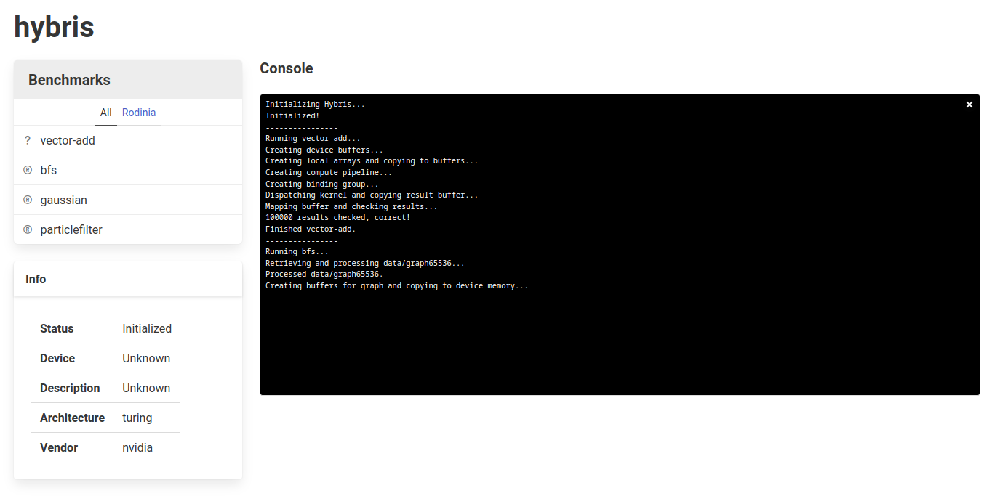

# GPU Compute Benchmarking with WebGPU

### By Devon McKee

## Table of Contents

1. [Introduction](#introduction)
    - [GPU Compute](#gpu-compute)
    - [WebGPU](#webgpu)
2. [GPU Compute Benchmarking](#gpu-compute-benchmarking)
    - [Rodinia](#rodinia)
    - [Hetero-Mark](#hetero-mark)
    - [Crystal](#crystal)
3. [Project Breakdown](#project-breakdown)
    - [Tekhne](#tekhne)
    - [Hybris](#hybris)
4. [CUDA Kernel Transpilation](#cuda-kernel-transpilation)
    - [Built-in Variables](#built-in-variables)
    - [Kernel Arguments](#kernel-arguments)
    - [Shared Memory](#shared-memory)
5. [Rodinia Transpilation Feasibility](#rodinia-transpilation-feasibility)
6. [Benchmarking Results](#benchmarking-results)
    - [BFS Timings (same system)](#bfs-timings-same-system)
    - [BFS Timings (multiple systems)](#bfs-timings-multiple-systems)
7. [Discussion](#discussion)
8. [Future and Related Work](#future-and-related-work)

## Introduction

In the current era of computing, more and more systems are forced to take advantage of heterogeneous computing in order to match the demand for high-performance operation and computation of results requiring massive parallelism. This pursuit is maybe best represented by the creation and subsequent popularity of the graphics processing unit (GPU). 

Computer graphics represents a series of workloads that involve a high level of data-level parallelism (DLP), and as such accelerators specialized for graphics workloads contain a multitude of processing cores, allowing for hundreds, thousands, or even tens of thousands of jobs to be computed in parallel. Evidently, GPUs outperform any other type of hardware with graphics workloads, and are able to exploit the high level of DLP to compute results in sheer milliseconds, enough to render frames from complex graphics pipelines quickly enough to trick the human eye into perceiving motion. 

However, the efficiency of GPUs at processing tasks with high DLP has not been unnoticed by systems programmers, and much work has been put forward in the use of GPUs for general purpose computing (GPGPU). This work has led to a split in the focus of GPU programming, with work often being specialized towards either graphics or compute workloads.

### GPU Compute

The process of using GPUs for general purpose computing tasks is one that can vary greatly across systems. On systems using Intel integrated GPUs (iGPUs), the prevailing option is SYCL, a cross-platform abstraction layer for heterogeneous computing. On systems using AMD GPUs (dedicated or otherwise), the prevailing option is AMD's in-house Heterogeneous-Computing Interface for Portability, or HIP. On NVIDIA GPUs, the prevailing option is their own Compute Unified Device Architecture, or CUDA. 

As NVIDIA GPUs continue to make up a significant portion of dedicated graphics hardware in not only consumer systems, but corporate and academic systems as well (though this is changing somewhat as AMD focuses more efforts towards datacenter-level hardware), CUDA has shown itself to be the de-facto standard for processing GPU compute workloads. Much of the mass of GPU-accelerated programming out there involves CUDA in some fashion, and as such is able to take advantage of some optimizations specific to these NVIDIA GPUs.

However, this comes with a major problem — CUDA is a framework that is written exclusively for NVIDIA GPUs, and as such CUDA code is not easily run on systems with other GPUs without some form of translation involved. There exist a number of different projects to translate CUDA code to other, more portable frameworks. Most often, CUDA is converted to OpenCL, as it provides a relatively similar API and is supported by a wide array of GPU drivers. The process of translating CUDA to other frameworks is on occasion done manually, but more often than not involves some automatic translation, some examples of which can be seen in the [Future and Related Work](#future-and-related-work) section. 

### WebGPU

In other areas of computing, there exists a trend of software being moved from native system implementations to web interfaces, particularly when much of the heavy lifting of that software can be done serverside. This is particularly helpful for tasks that are performance-bound, but not IO-bound as the major cost incurred in doing so is the penalty of transferring data between client and server, especially in situations where clients may have poor internet connections.

This, however, is not a perfect solution for all workloads, and many efforts have been put together to mesh the performance exploitation of a native system implementation with a web interface. One example of this is in WebAssembly, which allows browser engines to parse and execute binaries outside of the constraints of web programming languages like JavaScript.

In the same vein, there have been a number of efforts to exploit the power of GPU devices in web clients. Of those, the most widely used currently is WebGL. WebGL is a JavaScript API that allows the rendering of graphics workloads with any compatible browser without the need for any external addons. WebGL is heavily based on OpenGL ES, and much of its implementation conforms to the OpenGL ES standard. 

WebGL2 is a more recent incrementation of the API that moves the standard from OpenGL ES 2.0 to 3.0, and exposes a number of new features such as compute shaders. This addition allows for web applications to take advantage of the power of GPGPU programming, but it comes with some caveats. WebGL is an API built primarily for use in graphics workloads, and as such its compute implementation is less robust to the complex needs of GPGPU programmers. Similarly, graphics programmers have had some conflicts with the outdated nature of the OpenGL ES standard, and 

From these concerns comes WebGPU, a future JavaScript API hoping to provide modern hardware-accelerated graphics and compute capabilities to web applications. WebGPU's specification is currently being edited by developers at Google and Apple (and formerly Mozilla), and appears to be approaching a state of completion. Chrome includes an implementation of WebGPU that is very nearly up to date with the standard, and Safari and Firefox are continually working on their own implementations. Chrome's experimental implementation can be enabled with a flag for local testing (either in `about://flags#enable-unsafe-webgpu` or via command line with the `--enable-unsafe-webgpu` flag, though the former may have been removed recently), or enabled on a site if it [serves a valid origin trial token](https://developer.chrome.com/en/docs/web-platform/webgpu/#enabling-support-during-the-origin-trial-phase). The stable release for WebGPU is expected to happen sometime around Chrome 109, which according to Chrome's release schedule should be released Feb 1, 2023.

<figure>
    
    <figcaption align="center">WebGPU Architecture Diagram, from <a href="https://developer.chrome.com/en/docs/web-platform/webgpu/">Google Chrome's developer documentation</a></figcaption>
</figure>

WebGPU, while providing some lower-level GPU abstractions, does not run directly on the GPU. Rather, it relies on an underlying GPU framework supported by the system GPU driver. On systems running Windows, WebGPU attempts to use DirectX 12. On systems running MacOS, WebGPU attempts to use Metal. On systems running some flavor of Linux, WebGPU attempts to use Vulkan (though this also requires the command line flag `--enable-features=Vulkan`). The advantage of WebGPU running on these three GPU frameworks is that they are very modern in their construction, and the feature sets of each matches up well with the capabilities provided by WebGPU.

One of the important components of any GPU framework is the shading language that it implements. A shader, in the context of GPU programming, is a program running on a GPU device. They are written in domain specific languages, called shading languages, that are then compiled and executed by a system's GPU driver. Since WebGL is based on the OpenGL ES specification, it relies on the OpenGL Shading Language (GLSL). Initially, WebGPU experimented with support for GLSL or SPIR-V, the shading language provided alongside Vulkan by the Khronos Group, but eventually moved towards developing their own. This language is called the WebGPU Shading Language, or WGSL for short. WGSL is compiled down to the shading language required by the underlying platform framework (HLSL for DirectX, MSL for Metal, SPIR-V for Vulkan), which allows it to run portably on multiple client operating systems.

However, with WebGPU's exposure of the GPU device to web applications comes some security and identification concerns. First, there are a number of security considerations [enumerated in detail in the WebGPU specification](https://www.w3.org/TR/webgpu/#security-considerations) that are currently being resolved. Much of this work has involved undefined behavior and memory access, and developers working on the various implementations of WebGPU have had to do some serious work to ensure proper sandboxing of WebGPU processes. Another serious set of concerns brought up are those around privacy and fingerprinting of GPU devices. This is again [mentioned in detail in the WebGPU specification](https://www.w3.org/TR/webgpu/#security-considerations), but is still an unresolved issue. WebGPU does its best to limit the amount of machine-specific information that it exposes to developers, including feature capabilities and limits, but work is still ongoing to determine a proper long term solution.

## GPU Compute Benchmarking

There exists a number of different benchmark suites commonly used to test the heterogeneous computing capabilities of a system. Since this project concerns itself with GPU compute benchmarking, a few will be discussed here. Note that this is certainly not an exhaustive list of the range of heterogeneous computing benchmarks out there, but includes some common mainstays.

### Rodinia

[Rodinia](https://www.cs.virginia.edu/rodinia/doku.php) is a benchmark suite "designed for heterogeneous computing infrastructures," released by students at University of Virginia in 2009. It provides implementations of 23 different benchmarks in CUDA, OpenCL, and OpenMP, and covers a wide array of high-performance computing applications. Because of its generally low use of advanced CUDA-specific techniques and wide selection of benchmarks to choose from, as well as its common usage as a GPU compute benchmark, it was the benchmark suite chosen to be translated for this project. The paper can be found [here](https://www.cs.virginia.edu/~skadron/Papers/rodinia_iiswc09.pdf).

### Hetero-Mark

[Hetero-Mark](https://ece.northeastern.edu/groups/nucar/software/hetero-mark/) is a "benchmark suite for collaborative CPU-GPU computing." Released in 2016 by NUCAR, a lab at Northeastern University, it includes a number of useful benchmarks for testing the capabilities of heterogeneous systems and provides implementations in CUDA, OpenCL, and HCC (a now deprecated compiler for AMD heterogeneous computing that has since been replaced by HIP). The benchmark includes a number of interesting workloads that well represent the tasks required of a CPU-GPU system, but utilizes a couple more modern CUDA features and thus was relegated to a second choice for this project. The paper can be found [here](https://ieeexplore.ieee.org/document/7581262).

### Crystal

[Crystal](https://github.com/anilshanbhag/crystal) is a "collection of block-wide device functions that can be used to implement high performance implementations of SQL queries on GPUs." It is a project released by students at MIT and University of Wisconsin-Madison in 2020, and is mentioned in a few recent papers while testing the performance of various GPU frameworks. As it primarily concerns itself with SQL, it is less applicable to this project, but worth mentioning in the landscape of GPU compute benchmarking. The paper can be found [here](http://anilshanbhag.in/static/papers/crystal_sigmod20.pdf).

## Project Breakdown

To approach the problem of GPU compute benchmarking on the web, this problem was split into two discrete components — Tekhne and Hybris.

### Tekhne

Tekhne, from the ancient Greek personification of art, craft, and technical skill, is a transpiler that takes in CUDA source code and transpiles it down to WGSL. It parses CUDA using a grammar written in [Lark](https://github.com/lark-parser/lark), and generates WGSL with a custom code generator written with a recursive visitation pattern. The entire transpiler is a single Python script, which can be viewed [here](https://github.com/boingboomtschak/tekhne/blob/main/tekhne.py).

<figure>
    
    <figcaption align="center">Screenshot of <a href="https://github.com/boingboomtschak/tekhne">Tekhne</a> transpiling a simple BFS kernel from Rodinia</figcaption>
</figure>

One of the major challenges in putting together a transpiler for a language as extensive as CUDA is creating a grammar that covers a sufficient amount of the language to parse even simple examples. The current version of Tekhne uses a grammar that, while not covering all of CUDA, covers a significant enough amount to parse many of the kernels in Rodinia. 

Lark, the Python parsing library used by Tekhne, provides a number of grammar features that make grammar construction much simpler, especially the mixing of regex and regex-like syntax in production rules. For example, below is an abbreviated section of the Tekhne CUDA grammar.

```
declaration : ctype CNAME ("[" expression "]")* ("=" expression)? ";"
            | ctype CNAME ("," CNAME)+ ";" -> mult_declaration
            | SHARED ctype CNAME ("[" expression "]")* ("=" expression)? ";" -> shared_declaration

conditional_else : "else" (("{" statement* "}")|statement)
conditional_if : "if" "(" expression ")" (("{" statement* "}")|statement)
conditional : conditional_if conditional_else*

while_loop : "while" "(" expression ")" (("{" statement* "}")|statement)
```

In patterns like conditionals and loops, where statements may be delineated by braces or not, it is important to have production rules that allow robust parsing and Lark's grammatical features make this particularly easy. 

Lark also includes a number of features that makes debugging grammars a much quicker process, such as parse tree visualization. This is shown below, with a code snippet from Rodinia's breadth first search (BFS) kernel and the resulting parse tree visualized with Lark.

```cuda
__global__ void
Kernel( Node* g_graph_nodes, int* g_graph_edges, bool* g_graph_mask, bool* g_updating_graph_mask, bool *g_graph_visited, int* g_cost, int no_of_nodes) 
{
	int tid = blockIdx.x*MAX_THREADS_PER_BLOCK + threadIdx.x;
	if( tid<no_of_nodes && g_graph_mask[tid])
	{
		g_graph_mask[tid]=false;
		for(int i=g_graph_nodes[tid].starting; i<(g_graph_nodes[tid].no_of_edges + g_graph_nodes[tid].starting); i++)
			{
			int id = g_graph_edges[i];
			if(!g_graph_visited[id])
				{
				g_cost[id]=g_cost[tid]+1;
				g_updating_graph_mask[id]=true;
				}
			}
	}
}
```

<figure>
    
    <figcaption align="center">Parse tree for <a href="https://github.com/yuhc/gpu-rodinia/blob/master/cuda/bfs/kernel.cu">Rodinia BFS kernel</a>, produced by Lark</figcaption>
</figure>

The resulting kernel after being processed through Tekhne and manually modified to fill in any missing components and resolve minor errors is included as a code snippet below.

```wgsl
@binding(0) @group(0) var<storage, read> g_graph_nodes_starting : array<u32>;
@binding(1) @group(0) var<storage, read> g_graph_nodes_no_of_edges : array<u32>;
@binding(2) @group(0) var<storage, read> g_graph_edges : array<u32>;
@binding(3) @group(0) var<storage, read_write> g_graph_mask : array<u32>;
@binding(4) @group(0) var<storage, read_write> g_updating_graph_mask : array<u32>;
@binding(5) @group(0) var<storage, read> g_graph_visited : array<u32>;
@binding(6) @group(0) var<storage, read_write> g_cost : array<u32>;
@compute @workgroup_size(${num_of_threads_per_block})
fn main(@builtin(workgroup_id) wg_id : vec3<u32>, @builtin(local_invocation_id) liid : vec3<u32>) {
    var tid : u32 = wg_id.x * ${MAX_THREADS_PER_BLOCK} + liid.x;
    if (tid < ${no_of_nodes} && g_graph_mask[tid] == 1) {
        g_graph_mask[tid] = 0;
        for (var i : u32 = g_graph_nodes_starting[tid]; i < (g_graph_nodes_no_of_edges[tid] + g_graph_nodes_starting[tid]); i++) {
            var id : u32 = g_graph_edges[i];
            if (g_graph_visited[id] == 0) {
                g_cost[id] = g_cost[tid] + 1;
                g_updating_graph_mask[id] = 1;
            }
        }
    }
}
```

As of this report, the current iteration is able to reconstruct basic WGSL syntax, but requires some work on the deeper intricacies of converting CUDA kernels to WGSL, such as translation of kernel arguments to uniform bindings. More information is provided on this in the section on [CUDA Kernel Transpilation](#cuda-kernel-transpilation).

### Hybris

Hybris, from the ancient Greek spirit of outrageous behavior, is a simple web interface for running benchmarks converted to WebGPU. It is served statically, uses [Bulma](https://bulma.io/) for simple, clean styling, and is set up to execute benchmarks translated to WebGPU/WGSL from Rodinia CUDA implementations. The repository is currently hosted using GitHub Pages, and the source is accessible [here](https://github.com/boingboomtschak/hybris)

<figure>
    
    <figcaption align="center">Screenshot of <a href="https://github.com/boingboomtschak/hybris">Hybris</a> interface</figcaption>
</figure>

As of this report, Hybris includes a basic vector addition kernel for initial testing and the translated version of the Rodinia breadth first search kernel. There are placeholders for two other benchmarks (Gaussian Elimination and Particle Filter), but completing those within the time frame of the project was not possible.

Hybris also displays some information about the requested GPU adapter, given by WebGPU. These are usually obfuscated or nonspecific, but with Chrome's `#enable-webgpu-developer-features` flag enabled, more information can be retrieved.

## CUDA Kernel Transpilation

Below are a number of descriptions of the challenges identified in transpiling CUDA kernels to WGSL. This is a list of those identified in the initial stages of the CUDA-WGSL transpiler, but there may be more unknown challenges to resolve in the near future.

### Built-in Variables

CUDA provides a number of built in variables representing various information about kernel launches, related to threads, blocks, warps, and grids. There are analogues to these that exist in WGSL (which more closely follow those provided by more modern GPU compute APIs), but it is not a one-to-one translation. Workgroup size, for example, corresponds to CUDA's runtime `blockDim` variable, but WGSL requires it to be declared at kernel compilation time.

### Kernel Arguments

CUDA allows for kernels to have arguments passed to them corresponding to "device pointers," which point to places in GPU device memory where data is held. Some logic is required to translate these to WGSL's buffer bindings, which have some semantic differences. CUDA kernels also accept device pointers to structs as arguments, which adds some complexity as it is currently unclear whether WGSL accepts buffers of struct types as bindings.

### Shared Memory

CUDA exposes memory with a particular memory specifier, `__shared__`, that describes memory held in an on-chip programmer-managed cache most similar to scratchpad memory. It is shared across invocations in a An analogue to this exists in WGSL, with memory specified to be in the [workgroup address space](https://www.w3.org/TR/WGSL/#address-spaces-workgroup), but some more work needs to be done on the intricacies of translating shared memory, particularly with dynamically allocated shared memory.

## Rodinia Transpilation Feasibility

To examine the possibility of transpiling Rodinia benchmarks to WebGPU/WGSL, some work had to be done to manually analyze the features present in each Rodinia benchmark and determine the overall complexity of working with it. Linked to the below figure is a spreadsheet assessing each of Rodinia's 23 benchmarks, the expected difficulty in automatic transpilation of the kernel, and the expected difficulty in manual translation of the driver code. 

<figure>
    
    <figcaption align="center"><a href="https://docs.google.com/spreadsheets/d/1h4gcyNU0LLn3zFcIawoxjTc8wtxS-tX2V_TuU3kwbsY/view">Rodinia Benchmark Transpilation Spreadsheet</a></figcaption>
</figure>

In the spreadsheet, the columns for transpilation/translation difficulty are colored by their difficulty. The rows for each benchmark are colored such that if both the translation and transpilation difficulty is low, the row will appear white instead of gray, and any of the highlighted rows are the benchmarks identified as good targets for the initial translation efforts in this project.

## Benchmarking Results

Below are two tables describing the measured timings results in executing the translated breadth first search (BFS) kernel in Hybris versus some timings collected with Rodinia's CUDA implementation. The first table includes timings collected with different data files on the same system (the first system in the second table). The second table includes timings collected on a couple different systems, along with their CPU, GPU, and OS/Architecture.

### BFS Timings (same system)

| **Data File**   | **# Nodes** | **# Edges** | **Rodinia Execution Time (ms avg*)** | **Rodinia Kernel Execution Time (ms avg*)** | **Hybris Execution Time (ms avg*)** | **Hybris Kernel Execution Time (ms avg*)** |
|-----------------|-------------|-------------|--------------------------------------|---------------------------------------------|-------------------------------------|--------------------------------------------|
| graph4096.txt   | 4096        | 24576       | 82.8 ± 2.6                           | 0.2 ± 0                                     | 59.2 ± 6.2                          | 26.5 ± 2.1                                 |
| graph65536.txt  | 65536       | 393216      | 139.2 ± 2.3                          | 0.23 ± 0                                    | 233.1 ± 19.4                        | 30.4 ± 1.6                                 |
| graphh1MW_6.txt | 1000000     | 5999970     | 1038.7 ± 9.9                         | 1.78 ± 0.1                                  | 1988 ± 109.6                        | 60.1 ± 8.5                                 |

\*Averages taken across 10 runs

### BFS Timings (multiple systems)

| **OS/Architecture**       | **CPU**              | **GPU**               | **Rodinia Execution Time (ms avg*)** | **Rodinia Kernel Execution Time (ms avg*)** | **Hybris Execution Time (ms avg*)** | **Hybris Kernel Execution Time (ms avg*)** |
|--------------|----------------------|-----------------------|--------------------------------------|---------------------------------------------|-------------------------------------|--------------------------------------------|
| Linux/x86_64 | AMD Ryzen 7 3800X    | NVIDIA RTX 2080 Super | 1042.9 ± 12.4                        | 1.9 ± 0.2                                   | 1970.9 ± 109.6                      | 65.1 ± 4.6                                 |
| MacOS/M1     | Apple M1 Pro         | Apple M1 Pro          | n/a                                  | n/a                                         | 1214.2 ± 65.7                       | 43.8 ± 1.7                                 |
| MacOS/x86_64 | Intel Core i9 (2019) | AMD Radeon Pro 5500M  | n/a                                  | n/a                                         | 2159.8 ± 427.3                      | 61.0 ± 9.6                                 |

\*Averages taken across 10 runs, Rodinia times taken from CUDA-capable device

## Discussion

As mentioned earlier, the timings above only include the translated breadth first search (BFS) kernel from Rodinia as it was the only kernel able to be translated within the project time frame. 

As may have been expected, the Rodinia (CUDA) implementation consistently beat out the timings of the Hybris (WebGPU) implementation in the timings on the same system. This is expected as the driver for CUDA is written in CUDA C, where the WebGPU driver is written in JavaScript. Most of the execution time is spent parsing the large input data file, which definitely takes more time. It is interesting to see that the kernel execution time is different (about an order of magnitude larger), but still within a reasonable range.

The tests on different systems bring up some interesting results. It should be mentioned that these are not perfect tests, as there are a number of variables in play and the Rodinia CUDA times are taken exclusively from the CUDA-capable machine in the set. 

The M1 chip seemed to consistently outperform even the higher spec x86 desktop, which likely hints at a number of deeper architectural optimizations — the M1 systems include CPU-GPU unified memory and a higher speed bus between the CPU and GPU as they are contained within the same chip. 

The MacOS x86 laptop had similar results to the x86 desktop, despite the NVIDIA GPU performing >2x better in external benchmarks. This might hint at much of the time consisting of penalties being paid under the hood with WebGPU that is not as related to the underlying speed of the chip.

## Future and Related Work

As may be apparent throughout this project report, there is a fair amount of future work, both in continuing the translation of Rodinia kernels and expanding the capabilities of the CUDA-WGSL transpiler. In particular, future work is expected to be focused on translating the other two Rodinia kernels identified as priority targets (Gaussian Elimination and Particle Filter), and expanding the logic in translating CUDA kernel arguments to WGSL uniform bindings.

This project is certainly not alone in trying to bring portability to the wealth of existing CUDA code, and below is a short list of some related projects.

- [CuPBoP](https://arxiv.org/abs/2206.07896): A very recent paper, published to arXiv in 2022, that introduces a new framework for converting CUDA code using portable LLVM backends without manual programmer intervention  
- [DPCT](https://www.intel.com/content/www/us/en/developer/tools/oneapi/dpc-compatibility-tool.html): A tool distributed by Intel that helps convert CUDA code to DPC++ code that uses SYCL for heterogeneous computing  
- [HIPIFY](https://github.com/ROCm-Developer-Tools/HIPIFY): A tool distributed by AMD that uses clang's CUDA support to convert CUDA to AMD card compatible HIP
- [gpucc](https://dl.acm.org/doi/10.1145/2854038.2854041): A paper presented at the 2016 ACM Code Generation and Optimization (CGO) conference that describes an open source compiler for CUDA that helped form the basis for clang support for CUDA 
