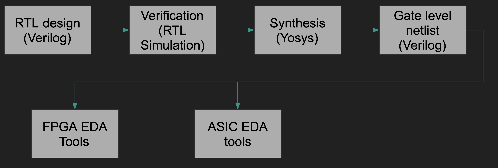
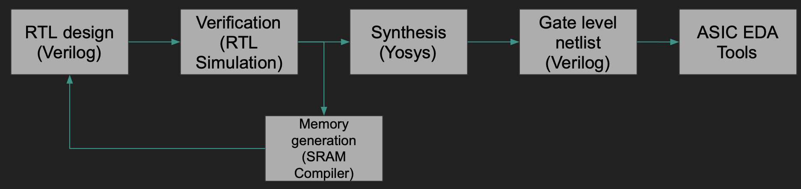
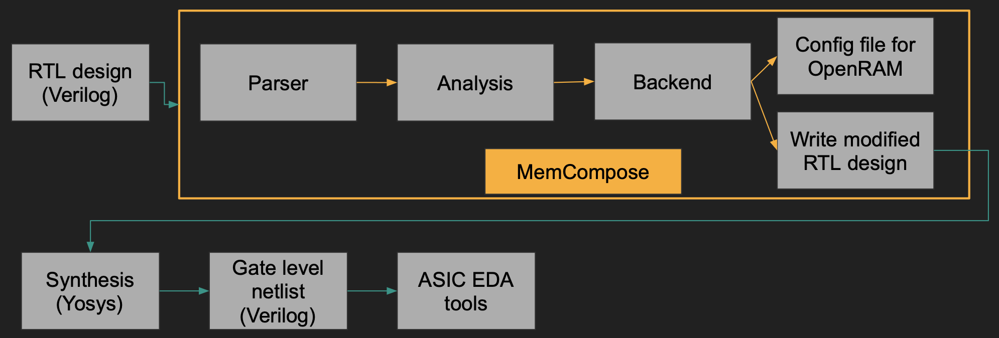

# Introduction
MemCompose was made as part of the final project of CSE 211. This tool is a memory synthesis compiler that automates the memory synthesis for ASIC backend.
Since this project is more hardware oriented a brief background is presented to be able to comprehend what problem is being solved.
# Background
The traditional hardware design flow roughly follows the following diagram:



The hardware logic is usually written in a hardware description language named Verilog. This logic modeled in Verilog is generally called Register-Transfer Level (RTL). Like any other software project, once the hardware is modeled it is verified using testbenches to make sure it performs its intended behavior. After verification, the RTL is provided to a synthesizer to transform higher level constructs written in Verilog to actual gates and flip-flops. It is the job of the synthesizer to take a higher abstraction of logic and transform it to low-level Verilog with only gates also known as gate-level netlis. In the above diagram a tool called Yosys is mentioned which is an open-source synthesis tool. The gate-level netlist is then passed on to either FPGA based Electronic Design Automation (EDA) tools or ASIC based EDA tools depending upon the backend target.

# Problem Statement
Most of the hardware design requires some kind of memories to store certain data. In Verilog memories are generally declared as 2-D register arrays like:

```verilog
reg [15:0] RAM [1023:0];
```
The above syntax indicates a memory with 16 bit word size and a depth of 1024 rows. For the FPGA backend Yosys supports directly mapping these memory declarations to efficient Block RAMs (BRAMs) available on the FPGAs. This saves the time of the RTL designer as they don't have to think about porting their 2-D register array declarations on each FPGA. In short Yosys offers portability to the front-end designer. 

Unfortunately, this automatic mapping is not available on the ASIC backend. The ASIC backend flow involves manually compiling the SRAMs by an SRAM compiler and instantiating the generated verilog file inside your design. The flow diagram for an ASIC backend is shown below.



This increases the time spent on the design entry stage since the designers have to call the SRAM compiler, pass in the parameters such as the word size, depth, and the number of ports and instantiate the generated verilog in their design. This causes the following problems:
*  Increase in the time spent on verification since the          verification needs to be re-done with the new SRAM models. 

* Susceptible to the designer's mistake of not choosing efficient memory parameters for the task.

Compilers are known to automate and optimize such tasks. Moreover, Yosys already doing this mapping for FPGA backends further proves this problem to be automatable.

## How can we solve it?

We can use compiler techniques to parse the memory declarations in the verilog, do some analysis of the Abstract Syntax Tree (AST) and generate a configuration file for an open-source memory compiler framework OpenRAM. We can then instantiate the memory instance inside the verilog.

## MemCompose to the rescue

MemCompose essentially does the above. It is composed of three components:

1. Parser
2. Analysis
3. Backend

Below is the flow of memory synthesis with MemCompose:



MemCompose uses PyVerilog as a front-end parser to create an AST of the RTL design. It then extracts various important features like the memory declarations, port names, and module name to be able to later generate the verilog file with the memory instantiated. 

The analysis is done on the dataflow graph generated from the RTL design. This provides binding mappings to the memory. Analysis is done on these bindings to infer the read/write ports of the memory. 

The backend is then used to write two different files. One is the modified RTL design with the memory instantiated inside it and the other is the configuration file that can be provided as input to the OpenRAM compiler for generating the memory. 